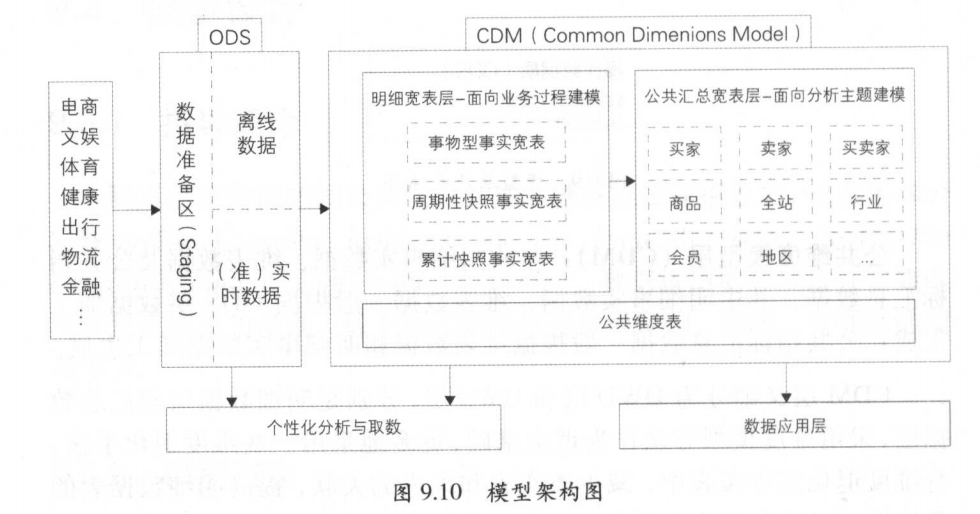
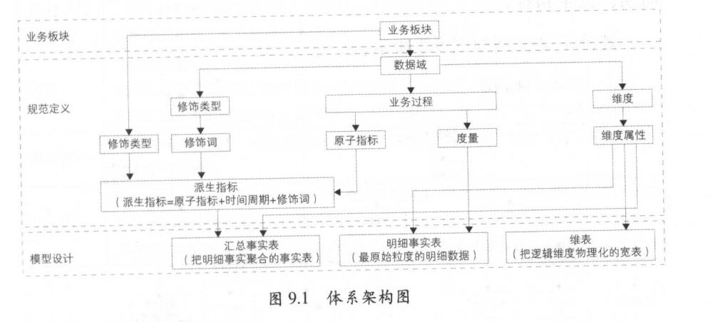

# 阿里巴巴大数据实践
>读书笔记

## 模型层次 p148

阿里巴巴的数据团队把表数据模型分为三层 ：操作数据层（ ODS ）、
公共维度模型层（ DM ）和应用数据层（ DS ）， 其中公共维度模型层
包括明细数据层（ DWD ）和汇总数据层（ DWS ）。模型层次关系如
9.9 所示。

操作数据层（ ODS ）：把操作系统数据几乎无处理地存放在数据仓
库系统中。
同步：结构化数据增量或全量同步到 MaxCompute
结构化：非结构化（日志）结构化处理并存储至lj MaxCompt闹。
累积历史、清洗：根据数据业务需求及稽核和审计要求保存历史
数据、清洗数据。

公共维度模型层（ CDM ）：存放明细事实数据、维表数据及公共指
标汇总数据 其中明细事实数据、维表数 一般根据 ODS 层数据加工
生成 ：公共指标汇总数据 般根据维表数据和明细事实数据加工生成。
CDM 层又细分为 DWD 层和 DWS 层，分别是明细数据层和汇总数
据层，采用维度模型方法作为理论基础 更多地采用 些维度退化手法，
将维度退化至事实表中，减少事实表和维表的关联 ，提高明细数据
易用性 ：同时在汇总数据层， 加强指标的维度退化， 采取更多的宽表
手段构建公共指标数据层，提升公共指标的复用性，减少重复加工。其
主要功能如下。

·组合相关和相似数据：采用明细宽表，复用关联计算，减少数据
扫描。
·公共指标统 加工：基于 OneData 体系构建命名规范、口径
和算法统 的统计指标，为上层数据产品、应用和服务提供公共
指标 立逻辑汇总宽表。
建立 致性维度：建立 致的数据分析维表，降低数据计算口径、
算法不统一的风险。

应用数据层（ ADS ）：存放数据产品个性化的统计指标数据，根据
CD 层与 ODS 层加工生成
149 .iii 
一寸大数据之路一一阿里巴巴大数据实践
·个性化指标加工：不公用性、复杂性（指数型、比值型、排名型
指标）。
．基于应用的数据组装 大宽表集市、横表转纵表、趋势指标串。

## 冗余维度 p195

在传统的维度建模的星形模型中，对维度的处理是需要单独存放在专门的维度表中，通过事实表的外键获取维度。
这样做的目的是为了减少事实表的维度冗余，从而减少存储消耗。而在大数据的事实表模型设
计中，考虑更多的是提高下游用户的使用效率，降低数据获取的复杂性，
减少关联的表数量。
所以通常事实表中会冗余方便下游用户使用的常用维度，以实现对事实表的过滤查询、控制聚合层次、排序数据以及定义主从关系等操作。

## 确定维度 p199

## 冗余维度 p200

## 事务事实表和周期快照事实表 p211  商户分级应该使用周期快照事实表

1. 用快照采样状态

2. 快照粒度

3. 密度与稀疏性

快照事实表和事务事实表的 个关键区别在密度上。事务事实表是
稀疏的，只有当天发生的业务过程，事实表才会记录该业务过程的事实，
如下单、支付等；而快照事实表是稠密的，无论当天是否有业务过程发
生，都会记录 行，比如针对卖家的历史至今的下单和支付金额，无论
当天卖家是否有下单支付事实，都会给该卖家记录一行。稠密性是快照
事实表的重要特征，如果在每个快照周期内不记录行，比如和事务事实
表一样 ，那么确定状态将变得非常困难。

4. 半可加性

## 周期快照事实表来源 p215

可以从事务事实表进行汇总产出，这是周期快照事实表常见的一种产出模式。
除此之外，还有种产出模式，即直接使用操作型系统的数据作为周期快照事实表的数
据源进行加工，比如淘宝卖家星级、卖家 DSR 事实表等。

前面所述的卖家信用分和 DSR 评分都是在操作型系统中计算完成
的，阿里巴巴数据仓库关于淘宝卖家信用分和 DSR 快照事实表是直
采用操作型系统数据进行设计加工，采样周期是每天，针对卖家维度的
统计，状态度量就是卖家信用分和 DSR 评分，

## 全量快照事实表

## 累计快照事实表