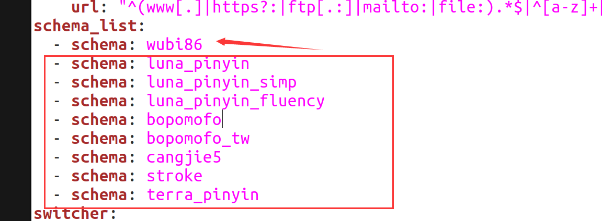

# ubuntu desktop 作为开发机 尝试使用ibus-rime输入法
> ibus-rime 输入法

# 实际使用非常稳定 不会再出现下划线和乱码的情况 不会破坏已经输入的文字

```
sudo apt install ibus-rime

sudo apt install librime-data-wubi

ibus-daemon -drx

ibus-setup //ubuntu22.04就用自带的输入法配置界面吧
```

编辑这个文件：~/.config/ibus/rime/build/default.yaml (这个文件也有可能是~/.config/ibus/rime/default.yaml，也就是少了一层build目录.)

在schema_list下边添加一行内容:- schema: wubi86，然后把其他的方案都删除掉.（其他方案就是下图方框中的内容）



# 左 shift 键 默认行为修改

原来是

```
    Shift_L: inline_ascii
    Shift_R: commit_text
```

改成

```
    Shift_L: commit_text
    Shift_R: inline_ascii
```

这样可以和mac的快捷键保持一致， 左shift在输入中也可以直接切换中英文了

> https://github.com/rime/librime
> https://github.com/rime/ibus-rime
> https://github.com/rime/home/wiki/RimeWithIBus

> https://blog.csdn.net/Sacredness/article/details/92195032
> https://www.cnblogs.com/keatonlao/p/12983158.html

