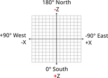

# PocketMine MP 插件开发学习记录
> PocketMine MP 插件开发学习记录

## 1.比较重要的一个方块类 VanillaBlocks

VanillaBlocks

可以使用 VanillaBlocks::XXXX 静态方法创造新的方块. 示例代码如下:

```php
namespace bigbao\Building;

use pocketmine\block\VanillaBlocks;
use pocketmine\event\Listener;
use pocketmine\event\player\PlayerMoveEvent;
use pocketmine\math\Vector3;

class EventListener implements Listener{
    public function onPlayerMove(PlayerMoveEvent $event): void
    {
        if ($event->isCancelled()) {
            return;
        }

        $player = $event->getPlayer();
        $player->sendMessage("From: " . $event->getFrom());
        $player->sendMessage("To: " . $event->getTo());

        $player->getWorld()->setBlock(
            new Vector3($event->getTo()->getX()+3, $event->getTo()->getY()+5, $event->getTo()->getZ()+2),
            VanillaBlocks::ANVIL()
        );
        //$event->cancel();
    }
}
```

> 上面代码是在玩家旁边位置的空中(相对玩家东3个方块, 南2个方块, 高5个方块位置)生成铁毡, 铁毡生成后会掉下来, 如果在头顶生成会把玩家砸死^_^

世界坐标基于一个由互相垂直且交于一点（即原点）的三条坐标轴形成的网格，即一个空间直角坐标系。

- X轴的正方向为东，其坐标反映了玩家距离原点在东（+）西（-）方向上的距离。
- Z轴的正方向为南，其坐标反映了玩家距离原点在南（+）北（-）方向上的距离。
- Y轴的正方向为上，其坐标反映了玩家位置的高低程度（其中海平面为63），另见海拔高度。
- 坐标系的单位长度为一个方块长，基于测量方法，每一方块的体积为1立方米。



[摘自: https://minecraft.fandom.com/zh/wiki/%E5%9D%90%E6%A0%87?variant=zh](https://minecraft.fandom.com/zh/wiki/%E5%9D%90%E6%A0%87?variant=zh)

## 2.Item 和 Block 有什么区别呢？

